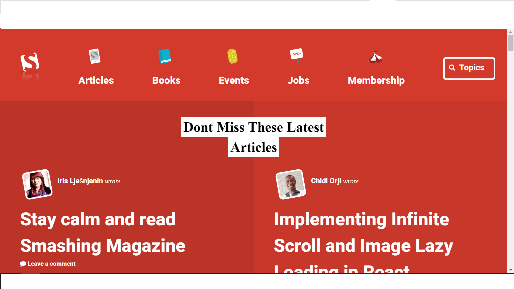

# Smashing magazine clone

Clone of Smashing magazine web page for study purpose

[Original site](https://www.smashingmagazine.com/)

> This is an assigment for Microverse HTML and CSS course. The goal is to clone the Smashingmagazine article page with static functionability.

Additional description about the project and its features.

## Built With

- HTML,
- CSS,
- Visual Studio Code

## Live Demo

[Live Demo](https://rawcdn.githack.com/NiiazalyDzhumaliev/smashingmagazine-clone/0f4730264ad1ffbfde48eee4c63a349c029bde95/index.html)

## Getting Started

To get a local copy up and running follow these simple example steps.

### Prerequisites

- A compatible browser with HTML and CSS.

### Install

- Just clone the project

### Usage

- Open the index.html file in any browser or edit using Visual Code or the preference IDE for web development

## Authors

👤 **Taofeek Abiodun Olalare**

- Github: [@teekaytech](https://github.com/teekaytech)

👤 **Niiazaly Dzhumaliev**

- Github: [@NiiazalyDzhumaliev](https://github.com/NiiazalyDzhumaliev)

## 🤝 Contributing

Contributions, issues and feature requests are welcome!

Feel free to check the [issues page](https://github.com/fdfragoso/nyt-clone/issues).

## Show your support

Give a ⭐️ if you like this project!

## Acknowledgments

- The Odin Project
- Smashing magazine

## 📝 License

This project is free to use as learning purposes. For any external content (e.g. logo, images, ...), please contact the proper author and check their license of use.
